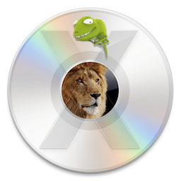

# Lion-DVD-Creator
For Hackintosh PC and Laptop

<p></p>

#### This program will create a bootable ISO image of Lion and determine the size of the DVD to use, 4.7GB or 8.5GB depending on the size of your Install Mac OS X Lion.app.
## This package is used in two steps:
- Step 1: Create the 4.7GB or 8.5GB DVD
- Step 2: Install Chameleon and the Network and Audio Drivers to the SSD were Lion is installed
### Everything is done manually using bash scripts.
- Read the script ➥ [Lion DVD Creator](https://github.com/chris1111/Lion-DVD-Creator/blob/main/Lion%20DVD%20Creator) ➥ [Install Chameleon](https://github.com/chris1111/Lion-DVD-Creator/blob/main/Install%20Chameleon)
- You can use this utility from Snow Leopard 10.6.8 up to macOS Tahoe 26 to create a DVD.
------------------------------------------------------------
### Usage: ⬇︎
- Git Clone

``` bash
git clone https://github.com/chris1111/Lion-DVD-Creator.git
```
Or Download ➤ [Lion DVD Creator](https://github.com/chris1111/Lion-DVD-Creator/archive/refs/heads/main.zip)
- Run from double clic on `Lion DVD Creator`

### 🎦 Video Usage ➤ [View Video](https://github.com/chris1111/Lion-DVD-Creator/blob/main/Video-Usage.md)

### A simple Widget for the project ➤ [Chameleon Forever](https://github.com/chris1111/Lion-DVD-Creator/blob/main/Widget-Usage.md)

------------------------------------------------------------
## Get Mac OS X Lion
#### Download the latest Lion 10.7.5 from Apple ➦ [Mac OS X Lion 10.7.5](https://support.apple.com/en-ca/106383) This one is for a 8.5g DVD Double Layer
#### Download Lion 10.7 from Internet Archive ➦ [Mac OS X Lion](https://archive.org/details/install-mac-os-x-lion.app) This one is for a 4.7g DVD

### Get ArticFox a compatible Browser for Lion ➤ [Arctic-Fox](https://github.com/rmottola/Arctic-Fox)

### Troubleshooting Fix Boot0 GPT ➤ [Fix Boot0 Error](https://github.com/chris1111/Lion-DVD-Creator/blob/main/Fix-Boot0-Error.md)

Please read this NOTE:
----------------------
You can create an iso of Mac OS X 10.7x

If you have already create 
Mac OS X Install DVD.iso on the desktop, 
it will automatically deleted by the script. 

So If you would like to create more disk images; put the images 
in a folder apart before continue

------------------------------------------------------------
### Thanks to Chameleon team
### Package created by chris1111
- Chameleon - Enoch v2.4svn -rev 2923 ⟨Build Xcode  9.2 (9C40b) ( date 2026-05-04 11:25:01 )⟩


